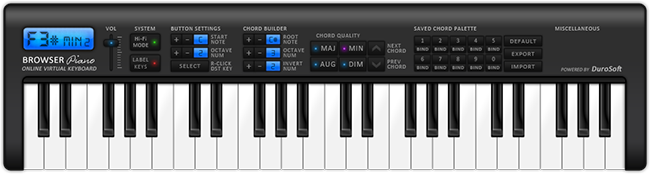

# browser_piano
A simple 100% pure javascript browser-based piano demo featuring multiple sound
channels (no JQuery or external libraries of any kind are used). Can be played
with computer keyboard. Uses unique sound channels to handle overlapping sounds.
This was designed before the HTML 5 audio specification was done, so sound channels
are implemented by spawning clones of HTML audio elements. This approach worked
surprisingly well (even in 2012), and is even better in modern browsers. On
slower/older systems this can be a bit of a performance hit.

Based on the original code from browserpiano.com from 2012-2014.

## Interactive Demo
[Click here](https://samkelly.github.io/browser_piano/) for an online interactive demo.
Uses computer keyboard keys or clicking as input. Supports pressing multiple keys at a
time, however certain browsers may have an issue with more than 3 keys at a time. This
is a limitation of the input system used by these browsers.

## Chord Builder
If I ever have time, I will finish implementing the code for the chord builder.
This includes a system for assigning chords to hotkeys and iterating over all
possible versions of all possible minor/major/diminished/augmented chords with
an easy-to-use interface. If completed, this would be extremely useful for people
who like to "figure out" compositions by ear. Right now this functionality exists
in the source code, but is not implemented in the GUI.
